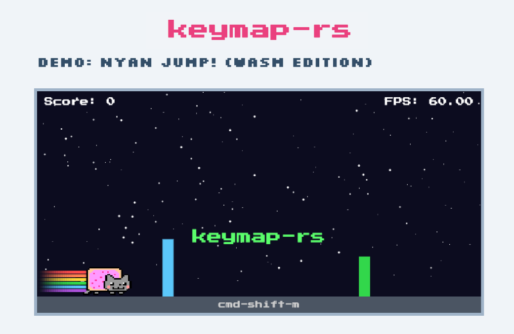

# keymap-rs

[](https://crates.io/crates/keymap)
[](https://docs.rs/keymap)
[](https://github.com/rezigned/keymap-rs/actions/workflows/ci.yml)
[](https://github.com/rezigned/keymap-rs/blob/main/LICENSE)

**keymap-rs** is a lightweight and extensible key mapping library for Rust that simplifies input processing for terminal user interfaces (TUIs), WebAssembly (WASM) applications, and more. It parses keymaps from derive macros or configuration files and maps them to actions from various input backends, including [`crossterm`](https://crates.io/crates/crossterm), [`termion`](https://docs.rs/termion/latest/termion/), and [`wasm`](https://webassembly.org/).

## 📋 Table of Contents

- [Installation](#-installation)
- [Usage](#-usage)
  - [1. Deriving `KeyMap`](#1-deriving-keymap)
  - [2. Using External Configuration](#2-using-external-configuration)
  - [3. Compile-Time Validation](#3-compile-time-validation)
  - [4. Direct Key Parsing](#4-direct-key-parsing)
- [Key Syntax Reference](#-key-syntax-reference)
- [Examples](#-examples)
- [License](#-license)
- [Contributions](#-contributions)

---

## 🔧 Features

* ✅ **Declarative Key Mappings**: Define keymaps via simple configuration files (e.g., TOML, YAML) or directly in your code using derive macros.
* ⌨️ **Key Patterns**: Supports single keys (`a`), combinations (`ctrl-b`), and multi-key sequences (`ctrl-b n`).
* 🧠 **Key Groups**: Use built-in pattern matching for common key groups (`@upper`, `@lower`, `@alpha`, `@alnum`, and `@any`).
* 📸 **Key Group Capturing**: Capture specific keypress data (like the actual `char` from `@any` or `@digit`) directly into your action enum variants at runtime.
* 🧬 **Compile-Time Safety**: The `keymap_derive` macro validates key syntax at compile time, preventing runtime errors.
* 🌐 **Backend-Agnostic**: Works with multiple backends, including `crossterm`, `termion`, and `wasm`.
* 🪶 **Lightweight & Extensible**: Designed to be minimal and easy to extend with new backends or features.

---

## 🕹️ Demo

See `keymap-rs` in action with the [WASM example](https://rezigned.com/keymap-rs/):

<table>
  <thead>
    <tr>
      <th width="500px">Nyan Jump!</th>
      <th width="500px">Tur - Turing Machine Language</th>
    </tr>
  </thead>
  <tbody>
    <tr>
      <td>
        <a href="https://rezigned.com/keymap-rs"></a>
      </td>
      <td>
        <a href="https://rezigned.com/tur"></a>
      </td>
    </tr>
  </tbody>
</table>

---

## 📦 Installation

Add `keymap` to your `Cargo.toml`, enabling the feature for your chosen backend:

```sh
cargo add keymap --feature {crossterm | termion | wasm}
```

---

## 🚀 Usage

### 1. Deriving `KeyMap`

The easiest way to get started is with the `keymap::KeyMap` derive macro.

**Define your actions:**

```rust
use keymap::KeyMap;

/// Application actions.
#[derive(KeyMap, Debug, PartialEq, Eq)]
pub enum Action {
    /// Quit the application.
    #[key("q", "esc")]
    Quit,

    /// Move left.
    #[key("left", "h")]
    Left,

    /// Move right.
    #[key("right", "l")]
    Right,

    /// Jump.
    #[key("space")]
    Jump,

    /// Key Group Capturing action (e.g. tracking which character was pressed).
    /// `char` will be captured from any matched key group macro (like `@any` or `@digit`) at runtime.
    #[key("@any")]
    Shoot(char),
}
```

**Use the generated keymap:**

The `KeyMap` derive macro generates an associated `keymap_config()` method, which returns a `Config<Action>`.

```rust
// Retrieve the config
let config = Action::keymap_config();

// `key` is a key code from the input backend, e.g., `crossterm::event::KeyCode`
// You can lookup the default pre-instantiated action reference:
match config.get(&key) {
    Some(action) => match action {
        Action::Quit => break,
        Action::Jump => println!("Jump!"),
        _ => println!("Action: {action:?} - {}", action.keymap_item().description),
    }
    _ => {}
}

// Or use Key Group Capturing to extract the actual `char` from `@any` or `@digit`!
if let Some(Action::Shoot(c)) = config.get_bound(&key) {
    println!("Captured key: {c}");
}
```

> **Note**: `keymap_derive` automatically generates custom `Serialize` and `Deserialize` implementations for the derived `enum`, making your variants with captured data serialize as simple tags (e.g. `"Shoot"`) out of the box so that Map deserialization continues to work flawlessly.

### 2. Using External Configuration

`keymap-rs` also supports loading keymaps from external files (e.g., `config.toml`). This is useful for user-configurable keybindings.

**Example `config.toml`:**

```toml
# Override or add new keybindings
Jump = { keys = ["j", "up"], description = "Jump with 'j' or up arrow!" }
Quit = { keys = ["@any"], description = "Quit on any key press." }
```

This configuration can be loaded in two ways:

#### `Config<T>`: Load from File Only

This deserializes **only** the keybindings from the configuration file, ignoring any `#[key("...")]` attributes on your enum.

```rust
// This config will only contain 'Jump' and 'Quit' from the TOML file.
let config: Config<Action> = toml::from_str(&data)?;
```

**Resulting keybindings:**

| Key           | Action |
| ------------- | ------ |
| `"j"`, `"up"` | Jump   |
| `@any`        | Quit   |

#### `DerivedConfig<T>`: Merge Derived and File Configs

This **merges** keybindings from the `#[key("...")]` attributes with those from the configuration file. Keys from the external file will override any conflicting keys defined in the enum.

```rust
// This config contains keys from both the derive macro and the TOML file.
let config: DerivedConfig<Action> = toml::from_str(&data)?;
```

**Resulting keybindings:**

| Key                      | Action | Source |
| ------------------------ | ------ | ------ |
| `"j"`, `"up"`            | Jump   | Config file (overrides `"space"`) |
| `"h"`, `"left"`          | Left   | Derive macro |
| `"l"`, `"right"`         | Right  | Derive macro |
| `@any`                   | Quit   | Config file (overrides `"q"`, `"esc"`) |

> **Note**: When using `DerivedConfig<T>`, keys from the config file take precedence over derive macro keys for the same action.

### 3. Compile-Time Validation

The `keymap_derive` macro validates all key strings at **compile time**, providing immediate feedback on invalid syntax.

**Invalid Key Example:**

```rust
#[derive(keymap::KeyMap)]
enum Action {
    // "enter2" is not a valid key.
    #[key("enter2", "ctrl-b n")]
    Invalid,
}
```

**Compiler Error:**

This code will fail to compile with a clear error message:

```
error: Invalid key "enter2": Parse error at position 5: expect end of input, found: 2
 --> keymap_derive/tests/derive.rs:7:11
  |
7 |     #[key("enter2", "ctrl-b n")]
  |           ^^^^^^^^
```

### 4. Direct Key Parsing

Key strings can also be parsed directly into a `KeyMap` or a backend-specific key event.

```rust
use crossterm::event::{KeyCode, KeyEvent, KeyModifiers};
use keymap::{backend::crossterm::parse, Key, KeyMap, Modifier};

// Parse into a generic KeyMap
assert_eq!(
    "ctrl-l".parse::<KeyMap>(),
    Ok(KeyMap::new(Some(Modifier::Ctrl), Key::Char('l')))
);

// Or use the backend-specific parser
assert_eq!(
    parse("ctrl-l").unwrap(),
    KeyEvent::new(KeyCode::Char('l'), KeyModifiers::CONTROL)
);
```

---

## 📝 Key Syntax Reference

| Type | Description | Example |
|---|---|---|
| **Single Keys** | Individual characters, special keys, arrow keys, and function keys. | `a`, `enter`, `up`, `f1` |
| **Key Combinations** | Keys pressed simultaneously with modifiers (Ctrl, Alt, Shift). | `ctrl-c`, `alt-f4`, `ctrl-alt-shift-f1` |
| **Key Sequences** | Multiple keys pressed in order. | `g g` (press `g` twice), `ctrl-b n` (Ctrl+B, then N), `ctrl-b c` (tmux-style new window) |
| **Key Groups** | Predefined patterns matching sets of keys. | `@upper` (A-Z), `@alpha` (A-Z, a-z), `@any` (any key) |

**Examples in Configuration:**
```toml
# Single keys
Quit = { keys = ["q", "esc"] }

# Key combinations
Save = { keys = ["ctrl-s"] }
ForceQuit = { keys = ["ctrl-alt-f4"] }

# Key sequences
ShowGitStatus = { keys = ["g s"] }
NewTmuxWindow = { keys = ["ctrl-b c"] }

# Key groups
AnyLetter = { keys = ["@alpha"] }
AnyKey = { keys = ["@any"] }
```

---

## 📖 Examples

For complete, runnable examples, check out the [`/examples`](https://github.com/rezigned/keymap-rs/tree/main/examples) directory.

---

## 📜 License

This project is licensed under the [MIT License](https://github.com/rezigned/keymap-rs/blob/main/LICENSE).

---

## 🙌 Contributions

Contributions, issues, and feature requests are welcome! Feel free to open an issue or submit a pull request.
